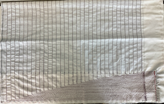

# Pressure Sensor Pad for Real-Time Ulcer Detection
This project is a custom-built pressure sensor pad designed to detect and monitor pressure distribution in surgical and ICU settings. The goal is to identify high-risk regions for pressure ulcers in real time, aiding in preventative care for hospitalized patients.

## 🔬 Project Overview

### Motivation
Pressure ulcers are a major complication for bedridden or post-surgical patients. This device aims to reduce incidence by:
- Continuously monitoring pressure points beneath a patient
- Alerting clinicians to prolonged or high-risk pressure areas
- Improving quality of care, particularly in oncology and ICU units

### Current Capabilities
- Real-time heatmap display of pressure distribution
- High-resolution 23x32 pressure grid
- Modular design using I2C analog switches for pad scanning
- User interface for fast zone feedback

## 🛠 Hardware

### Core Components
- `Arduino GIGA R1 WiFi`
- `Custom PCB` (designed in KiCad)
- `Velostat` for pressure sensing (conductive piezoresistive material)
- `ADG728 I2C Analog Switches` for row/column selection
- `Resistor network` for analog voltage division
- `GIGA Display Shield` for live visualization

### Circuit Summary
- The sensor matrix is scanned by selecting 1 row and 1 column at a time
- Voltage from each cell is read via the Arduino ADC
- All connections are routed through a custom-designed PCB

## 💻 Software

### Arduino Firmware
- Collects analog pressure data from the sensor matrix
- Controls ADG728s via I2C to select matrix zones
- Sends data to GIGA Display for visualization

### Machine Learning (Planned)
- Future implementation of a denoising autoencoder to correct raw data
- Will improve signal quality and filter noise from pressure readings

## 📊 Current Results
- All cells return live analog values
- Pressure heatmap successfully displayed in real time
- PCB assembled and functioning as intended
- Future test deployment planned at Cedars-Sinai surgical suite

## 🔮 Roadmap

| Milestone                     | Status     |
|------------------------------|------------|
| Initial prototype            | ✅ Complete |
| PCB design and assembly      | ✅ Complete |
| Real-time display            | ✅ Complete |
| Historic data + alert logic  | 🔄 In progress |
| Clinical suite testing       | 🔜 Planned |

## 🧪 Testing & Usage

### Power Supply
- Power via USB-C or external 5V rail

### Firmware Upload
1. Connect `Arduino GIGA R1 WiFi` via USB
2. Download the `PressurePadApp.zip`
3. Upload `PressurePadApp.ino` sketch using Arduino IDE

>Nessicary libraries: `Arduino_GigaDisplayTouch`, `Arduino_GigaDisplay_GFX`, and `lvgl` (v8.3.11)

### Hardware Setup
1. Position the `pressure pad` so that the connection points are at the bottom right (`red` side on top)
   
2. Connect the `red` connections to the `DEMULTIPLEXER OUTPUTS` section on the `pcb`
3. Connect the `blue` connections to the `MULTIPLEXER INPUTS` section on the `pcb`
4. Connect the `Arduino GIGA R1 WiFi` to the power source

## 🧱 File Structure

- `PressurePadApp:` Arduino sketch (.ino)
- `PCB:` KiCad files for custom PCB
- `Assets:` Github image files
- `Docs:` Presentation PDF, schematic images, reference material

## ✍️ Authors

- [@AlexAhitov](https://github.com/AlexAhitov)

