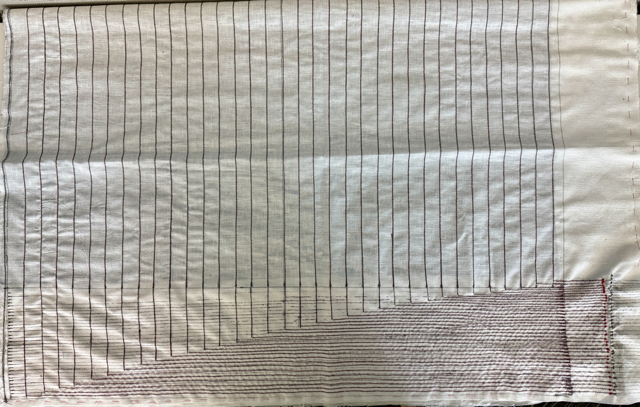

# Pressure Sensor Pad for Real-Time Ulcer Detection
A smart pressure-sensing pad for early detection of pressure ulcers.

## 📖 Table of Contents
- [🔬 Project Overview](#-project-overview)
  - [Motivation](#motivation)
- [🛠 Hardware](#-hardware)
  - [Core Components](#core-components)
  - [Circuit Summary](#circuit-summary)
- [💻 Software \& Interface](#-software--interface)
  - [Arduino Firmware](#arduino-firmware)
  - [User Interface](#user-interface)
- [🧪 Testing \& Usage](#-testing--usage)
  - [Power Supply](#power-supply)
  - [Firmware Upload](#firmware-upload)
  - [Hardware Guide](#hardware-guide)
  - [Software Guide](#software-guide)
- [📊 Current Results](#-current-results)
- [⚠️ Current Limitations](#️-current-limitations)
- [🔮 Roadmap](#-roadmap)
- [👷 Troubleshooting Guide](#-troubleshooting-guide)
- [🧱 File Structure](#-file-structure)
- [✍️ Authors](#️-authors)

## 🔬 Project Overview
This project is a custom-built pressure sensor pad designed to detect and monitor pressure distribution in surgical and ICU settings. The goal is to identify high-risk regions for pressure ulcers in real time, aiding in preventative care for hospitalized patients.

### Motivation
Pressure ulcers are a major complication for bedridden or post-surgical patients. This device aims to reduce incidence by:
- Continuously monitoring pressure points beneath a patient
- Alerting clinicians to prolonged or high-risk pressure areas
- Improving quality of care, particularly in oncology and ICU units

## 🛠 Hardware

### Core Components
- **Microcontroller:** `Arduino GIGA R1 WiFi`
- **Sensor Matrix:** 23 x 32 grid using `Velostat` (a piezoresistive plastic that changes resistance under pressure)
- **Switching Logic:** `ADG728` I2C analog switches for matrix scanning
- **PCB:** Custom `KiCad` board with routed traces for all sensor inputs
- **Display:** `Arduino GIGA Display Shield` for on-device heatmap visualization

### Circuit Summary
- One row and one column are selected via ADG728s
- Voltage from each cell is read via the Arduino ADC
- Pressure intensity is inferred from voltage level
- Repeats rapidly across entire matrix to produce a live heatmap
>Circuit design allows scanning one row and one column at a time to measure pressure at each intersection.

## 💻 Software & Interface

### Arduino Firmware
- Collects analog pressure data from the sensor matrix
- Controls ADG728s via I2C to select matrix zones
- Sends data to GIGA Display for visualization

### User Interface
- Built in `SquareLine Studio`
- Features:
  - Home Screen
  - Live zone overview
  - Full pressure grid view
  - Future: historic trends + movement alerts

## 🧪 Testing & Usage

### Power Supply
- Power via USB-C or external 5V line

### Firmware Upload
1. Connect `Arduino GIGA R1 WiFi` via USB
2. Download the `PressurePadApp.zip`
3. Upload `PressurePadApp.ino` sketch using Arduino IDE

>Necessary libraries: `Arduino_GigaDisplayTouch`, `Arduino_GigaDisplay_GFX`, and `lvgl` **(v8.3.11)**.

### Hardware Guide
1. Insert the `Arduino GIGA Display Shield` into `Arduino GIGA R1`
   
2. Insert the `Arduino GIGA R1 WiFi + Display` into the PCB (female headers facing down)
   
3. Position the `pressure pad` so that the connection points are at the bottom right (`red` side facing up)
   
4. Wire pad to PCB:
   - **Red leads** → `DEMULTIPLEXER OUTPUTS` (vertical header, right)
   - **Blue leads** → `MULTIPLEXER INPUTS` (horizontal header, bottom)
5. Power the board

### Software Guide
>Once the system is powered on and the display shield is connected, the UI will launch automatically.

**Main Screens:**
- **`Home Page:`** Displays system status and navigation buttons to access `Live Data Overview` and `Historic Data` pages
- **`Live Data Overview:`** Displays 12 large, tappable buttons, each corresponding to a zone of the pressure pad
  - Each button changes color in real time based on average pressure in that region
  - Tap a button to enter that zone’s detailed heatmap
- **`Live Data:`** Shows an 8×8 heatmap of the selected zone from the pad
  - Color-coded for quick identification of high-pressure points
  - Updated continuously based on sensor readings
- **`Historic Data (Under Development):`** Will display trends in pressure over time and trigger alerts for high-risk zones

**Navigation:**
- Touchscreen is fully interactive (capacitive touch)
- Use on-screen buttons to switch between screens
- Tap return icons to go back to previous pages

**Interpreting the Heatmap:**
- Axis orientation matches the physical pad as connected to the PCB:
  - X-axis runs **right to left**
  - Y-axis runs **bottom to top**
- Colors represent pressure levels:
  - 🔴 Red = high pressure (risk of ulcers)
  - 🟣 Purple = moderate
  - 🔵 Blue = minimal or no pressure
- Live updates occur at ~20–50ms per cell

## 📊 Current Results
- All cells return live analog values
- Pressure heatmap successfully displayed in real time
- PCB assembled and functioning as intended
- Future test deployment planned at Cedars-Sinai surgical suite

## ⚠️ Current Limitations

- Top sensor row (y = 24) currently shows noise due to physical layout constraints
- Calibration may vary with sensor wear
- Data is real-time only; historic pressure history not yet stored
- No wireless/cloud connectivity yet
- Must be handled carefully to avoid flex damage in Velostat

## 🔮 Roadmap

| Milestone                     | Status     |
|------------------------------|------------|
| Initial prototype            | ✅ Complete |
| PCB design and assembly      | ✅ Complete |
| Real-time display            | ✅ Complete |
| Historic data + alert logic  | 🔄 In progress |
| Clinical suite testing       | 🔜 Planned |

## 👷 Troubleshooting Guide

| Problem                                      | Possible Cause                                             | Solution                                                                 |
|----------------------------------------------|------------------------------------------------------------|--------------------------------------------------------------------------|
| Heatmap shows no data                        | Arduino not powered or not connected properly              | Check USB/5V supply and USB cable connection                            |
| Only partial pad is active                   | Incorrect multiplexer/demultiplexer wiring                 | Verify wiring between PCB and pad (red = demux, blue = mux)             |
| Data appears inverted or mirrored            | Pad is oriented incorrectly                                | Rotate the pad so the connection points are at the bottom right         |
| Zones not updating in UI                     | I2C communication issue or faulty ADG728                   | Check I2C addresses and power to switches                               |
| Arduino not recognized in IDE                | Wrong port or missing driver                               | Ensure correct port is selected and install board package in Arduino IDE |
| No image shown on display                    | Display shield not connected correctly                     | Reseat the display shield onto Arduino GIGA pins                        |
| Colors frozen on screen                      | Loop not running or memory issue                           | Reset Arduino, monitor serial for errors                                |
| Boot0 light flashing red after upload        | Invalid code upload or memory overflow                     | Double-click the RST button on top right of the Arduino (back-side) & reupload code |
| Solder joints not connecting (Arduino back)  | No through-holes to allow solder to bridge to PCB          | Use angled headers, conductive epoxy, or jumper wires to reroute traces |

## 🧱 File Structure
<pre>
PressurePad/
├── PressurePadApp/          # Arduino firmware and UI code
│   ├── PressurePadApp.ino
│   ├── ui_*.c / .h          # UI pages and assets
│   └── CMakeLists.txt
├── KiCad/                   # PCB schematic and layout files
│   └── pressure_pad.kicad_*
├── Assets/                  # Images for documentation
│   └── *.png
├── Docs/                    # Slides, references, design notes
│   └── *.pdf
└── .vscode/                 # VSCode config (not necessary for implementation)
</pre>

## ✍️ Authors

- [@AlexAhitov](https://github.com/AlexAhitov)

[**Back to the top**](#pressure-sensor-pad-for-real-time-ulcer-detection)

